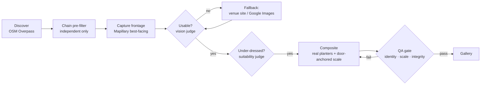

# Storefront capture & visualisation

Automated pipeline that finds independent London venues (cafés, restaurants, bakeries, salons, bars)
with **bare frontages**, captures a photo of each venue's **real entrance** from street-level imagery,
and composites the client's **actual planter products** into it — correct scale, believable shadow,
everything else unchanged. No step involves a human eyeballing a candidate, a framing, or a final image.

- **Design note:** [`design.md`](design.md) — framing strategy per imagery source, imagery-rights
  position, scale estimation, product-fidelity strategy, rejection criteria, venue-selection logic.
- **Live gallery:** _add your Vercel URL here after deploying_ · static files, no backend.
- **Selected venues (auto-generated per run):** [`SELECTED_VENUES.md`](SELECTED_VENUES.md)

**Active stack — no billing card anywhere:**

| Stage | Provider | Key needed |
|---|---|---|
| Venue discovery | OpenStreetMap Overpass | none |
| Frontage imagery | Mapillary (CC-BY-SA) | free token |
| Vision judging | Qwen `qwen-vl-max` (DashScope) | DashScope key |
| Compositing | Qwen `qwen-image-edit` (DashScope) | same key |

A Google Street View + Gemini stack is fully implemented as the alternative — flip
`IMAGERY_SOURCE=streetview` / `AI_PROVIDER=gemini` in `.env`.



Every stage is automated — no human selects a venue, a framing, or a final image.

---

## Editor mode (bonus)

Alongside the automated gallery, the site ships a **manual drag-and-drop editor** at
[`web/editor.html`](web/editor.html) (linked as **Editor** in the top nav) — for when an operator
wants hands-on control instead of the model's placement.

- Pick any delivered venue frontage from the dropdown, **or upload your own photo**.
- Drag the client's **real planter cut-outs** (the same products the pipeline uses) onto the image.
- **Scroll** to resize, **drag** to move, **R** to flip, **double-click** to remove.
- **Download PNG** exports the composite at full resolution.

It's a companion tool, not part of the graded pipeline — the automation produces the gallery; the
editor is there for bespoke, human-driven mock-ups.

---

## What you need to do manually

1. **Mapillary token (free):** [mapillary.com](https://www.mapillary.com) → sign in →
   **Settings → Developers → Register application** → copy the **Client Token** → paste into `.env`
   as `MAPILLARY_TOKEN`.
2. **DashScope (Qwen) key:** Alibaba Cloud **Model Studio** console → API keys. Already configured
   in `.env` for this machine. International keys use the `-intl` endpoint (default in config).
3. **(After a successful run) publish:**
   - GitHub: `git init && git add . && git commit -m "storefront visualiser" && git remote add origin <url> && git push -u origin main`
   - Vercel: import the repo — `vercel.json` already points the output at `web/`, no build step.
     Put the URL in this README and deploy.

That's it: **one free token, one push, one import.** Everything else runs itself.

## Install & run

Requires Python 3.9+ (`python` below — use `python3` on macOS/Linux if needed).

```bash
# from the repo root
python -m pip install -r requirements.txt

# product assets: HQ isolated shots + transparent cutouts + planters.json
python scripts/setup_planters.py

# full pipeline (stops after 3 delivered venues)
python run.py
python run.py --showcase      # rotate all 3 products across venues
python run.py --stop-after 5

# regenerate the venue list from the latest run
python scripts/fill_selected.py

# view the gallery (then open http://localhost:8000)
cd web && python -m http.server 8000
```

A run writes before/after images + the full decision log to [`web/data/`](web/data/) — commit that
folder so the deployed gallery shows real results.

## Cost

| API | Price | This project |
|-----|-------|--------------|
| OSM Overpass | free (fair use) | ~5 queries/run |
| Mapillary | free | dozens of image fetches |
| Qwen-VL judge | pennies per call | ~10–40 calls/run |
| Qwen image edit | ~£0.02–0.08/image | 3–9 edits/run |

Whole test: **well under £1**. No billing card required for imagery or discovery.

## Repo layout

```
design.md                  the design note (graded)
SELECTED_VENUES.md         auto-generated: what the pipeline picked / rejected
run.py                     end-to-end orchestrator + all decision logging
config.py                  every tunable + accept/reject threshold + provider switches
pipeline/
  models.py                shared Candidate dataclass
  prompts.py               judge/QA prompts (shared by Qwen + Gemini so the bar is identical)
  osm.py                   discovery via Overpass (active)
  mapillary.py             frontage capture via Mapillary: best-facing-image selection (active)
  qwen.py                  Qwen-VL judging + qwen-image-edit compositing (active)
  places.py                discovery + business photos via Google Places (alternative)
  streetview.py            Street View metadata + heading math capture (alternative)
  gemini_judge.py          Gemini judging + nano-banana editing (alternative)
  composite.py             SKU selection, door-anchored scale targets, edit prompt builder
  qa.py                    model-free scene-integrity pixel diff (backstop)
  utils.py                 bearing/haversine/slug helpers
assets/
  Plant_gemini*.png        upscaled isolated product shots (working sources)
  planters/                originals + HQ refs + transparent cutouts + planters.json
web/                       static site for Vercel (Apple-style, botanical theme)
  index.html               automated before/after gallery
  editor.html              manual drag-and-drop planter placer (optional companion tool)
scripts/                   setup_planters.py · fill_selected.py
```

## How the brief maps to the code

| Brief requirement | Where |
|---|---|
| Frontage from a location, framed on the real entrance | `mapillary.py` (bearing + aim-error ranking) / `streetview.py` (heading math) |
| Wrong-facing / occluded handling + fallback | ranked candidate chain in `run.py::capture_frontage` |
| Automated "is this framing usable?" | `analyze_frontage` (prompt in `pipeline/prompts.py`) |
| Imagery-rights position | `design.md` §1.4 |
| Composite the **real** products, correct scale | `composite.py` + `assets/planters/planters.json` |
| Scale from a reference object | door-anchor: judge `door_bbox` + `composite.ratio_target` |
| Product fidelity | HQ isolated refs + cutouts + identity QA (`design.md` §2.2) |
| Rejection criteria | `qa_composite` + `qa.scene_integrity` (`design.md` §2.3) |
| Automated venue selection + rejections listed | `osm.py` + judges + `SELECTED_VENUES.md` |
| Deployed link + design.md + README | `web/` on Vercel, this repo |
