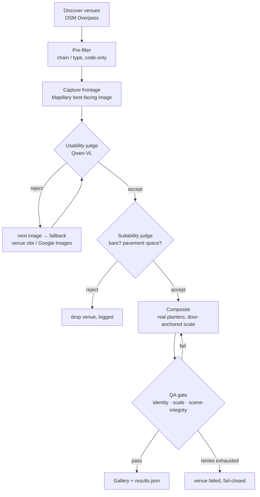

# Design note — Storefront capture & visualisation

**What this is.** An automated pipeline that, given nothing but a London area, finds independent
street-facing venues (cafés, restaurants, bakeries, salons, bars) with bare or under-dressed
entrances, captures a photo of each venue's *own* doorway from real street-level imagery, and
composites the client's **real** planter products into that photo believably and at correct scale.
Output is a per-venue before/after visual, produced with no human eyeballing any step.

**Active stack (zero billing-card):** OpenStreetMap Overpass (discovery, no key) → Mapillary
(street-level imagery, free token) → Qwen on DashScope (`qwen-vl-max` judging, `qwen-image-edit`
compositing). A Google Street View + Gemini stack is fully implemented as the alternative and
switchable in `.env` (`IMAGERY_SOURCE`, `AI_PROVIDER`) — both are covered below, because the two
imagery sources solve "framing" in instructively different ways.

Every gate is a small, explicit decision with a logged reason. The whole decision trail for a run is
written to [`web/data/results.json`](web/data/results.json) and rendered in the gallery.

**Automated by default, manual on demand.** The gallery venues are produced end-to-end by the
pipeline above — no human selects a venue, a framing, or a final image. For cases where an operator
*wants* control (a bespoke pitch, a frontage the pipeline skipped), the site also ships a companion
**drag-and-drop editor** ([`web/editor.html`](web/editor.html)): load any frontage (a delivered
venue or an uploaded photo), drag the client's real planter cut-outs onto it, resize/flip/position
them, and export a PNG. Same real products, same scale intuition — human-driven placement instead of
model-driven. It complements the automation; it is not part of the graded pipeline.

---

## 1. Getting the frontage image

A raw lat/lng is not a photo of a doorway. The two imagery sources require two different framing
strategies; the pipeline implements both behind one interface.

### 1.1a Active source — Mapillary: framing by *selection*

Mapillary images are fixed captures (you can't re-aim the camera), so a good frame must be *chosen*,
not rendered:

1. Query `graph.mapillary.com/images` in a ~45 m box around the venue for candidates with
   `geometry` (camera position), `compass_angle` (direction the camera faced), `is_pano`,
   `captured_at` and a 2048px thumbnail.
2. For each image compute **bearing(camera → venue)** (`pipeline/utils.py::bearing_deg`, standard
   `atan2` forward-azimuth) and the **aim error** = angular difference between that bearing and the
   image's own `compass_angle`. A camera that is *near* the venue **and** *pointing at it* (aim error
   ≤ 55°) will contain the frontage.
3. Rank: perspective images before panoramas, then nearest, then best-aimed; hand the top candidates
   (max 8) to the vision judge one at a time until one passes. The judge, not the geometry, makes the
   final call — compass metadata on crowdsourced imagery is too noisy to trust blind.

### 1.1b Alternative source — Street View: framing by *rendering*

Street View Static can render any heading from a panorama, so there the framing is computed:
free **metadata** call → nearest pano's exact camera position (reject if > 60 m away) →
**heading = bearing(pano → venue)** → fetch at FOV 78°, pitch +6°, 640×640. The same bearing math
drives both sources; only "select best existing frame" vs "render the ideal frame" differs.

### 1.2 When imagery faces the wrong way or doesn't show the entrance

- **Mapillary:** the ranked candidate list *is* the retry chain — if the best-aimed image fails the
  usability judge (wrong facade, occlusion, blur), the next candidate is judged, up to the retry cap.
- **Street View:** heading nudges of ±18° (fixes geocode offset), then the venue's Google Business
  photos as a second source, judged with the same bar.
- **Give up cheaply.** If no source yields a usable frontage, the venue is dropped with a logged
  reason. Discovery returns ~70+ candidates for 3 deliveries, so a dropped venue costs nothing — the
  brief explicitly accepts "one or two rejected attempts before falling back".

### 1.3 Accept / reject bar for a framing (automated)

`analyze_frontage()` (same prompt for Qwen and Gemini, `pipeline/prompts.py`) returns strict JSON;
a capture is **usable** only if: the street-level entrance is clearly visible; it looks like a
target business type (not an office lobby / house / car park / blank wall); the entrance is
reasonably centred and unobstructed (van, scaffolding, tree, crowd); daylight; in focus. Anything
else → rejected with a reason → next candidate. The bar is "usable for a mock-up", not "perfect".

### 1.4 Imagery-rights position

The honest core of the question, answered directly:

- **What we rely on.** Mapillary imagery is crowdsourced and licensed **CC-BY-SA 4.0**; API access is
  free and commercial use is permitted with attribution, which the gallery carries ("© Mapillary
  contributors"). OSM data is **ODbL** — attribution likewise carried. (The alternative stack uses
  Street View Static under Google Maps Platform ToS with Google's attribution preserved.)
- **The real exposure.** The licence is not the interesting risk. At commercial scale we are
  capturing a photo of **someone's real property**, modifying it, and sending it to them in
  **unsolicited outreach**. CC-BY-SA covers our use of the *photo*; it says nothing about the venue
  owner's reaction to their premises being altered in marketing material. Under UK/EU norms,
  photographing a storefront from a public street is lawful, and a 1:1 mock-up sent privately to the
  owner is low-risk — but it is a brand/PR judgement and, if venue data is stored at scale, a UK GDPR
  question (business contact data, lawful basis: legitimate interest with easy opt-out).
- **Position.** Acceptable for a prototype and for low-volume, 1:1 outreach with attribution kept,
  no public gallery of other people's premises, instant takedown/opt-out honoured, and the mock-up
  never presented as an existing installation. **Before 5k/week scale, commercial legal sign-off** —
  and note CC-BY-SA's share-alike property: derived *imagery* published broadly may need the same
  licence, one more reason these visuals stay private 1:1 attachments. The engineering mitigations
  are built; the go/no-go at scale is a legal decision we force, not absorb silently.

---

## 2. Compositing the planters

Approach: **reference-conditioned image editing** with `qwen-image-edit` (DashScope multimodal
generation, two image inputs verified) — not text-to-image. The frontage photo and the client's
product photo go in **as pixels**, so the model places *that* planter into *that* scene. This buys
photorealistic perspective/shadow for near-zero effort while keeping the product real — the brief
forbids "a generic AI approximation of some planters".

**Product assets** ([`assets/planters/`](assets/planters/), manifest
[`planters.json`](assets/planters/planters.json)):

| SKU | Material / shape | Planted height | Arrangement | Best fit |
|---|---|---|---|---|
| `cylinder_charcoal` | matte charcoal cylinder | ~1.10 m | single, right of door | wide frontages |
| `cube_corten` | corten-steel tiered cubes | ~1.30 m | cluster beside door | forecourts |
| `square_white` | white tapered square columns | ~1.15 m | **pair flanking the door** | narrow pavements (default) |

Three asset tiers per SKU, each with a job: the client's **original photos** (ground truth for
identity QA and provenance — the brief requires their actual products), an **HQ isolated version**
(upscaled, clean white background — the working reference passed to the edit model), and a
**transparent cutout** (background removed to true alpha, tight-cropped — used wherever pixels are
pasted directly, so no background rectangle can ever appear). Cutouts are generated by
`scripts/setup_planters.py` using **border-connected white flood removal**: only white pixels
connected to the image border become transparent. We chose this over ML matting (rembg/U²-Net)
after testing both — U²-Net ghosted the white pots (white-on-white) and partially erased the corten
cubes; the deterministic method preserves interior whites and non-white subjects exactly.

`planters.json` also carries per-SKU **placement metadata** used to build the edit prompt and any
direct paste: arrangement (single/pair/cluster), door offset in metres, minimum pavement width,
paste anchor (bottom-centre), pot-fraction of the cutout, and shadow guidance.

### 2.1 Estimating real-world scale from a reference object

Split in two — only one half needs per-image inference:

- **Product side (known, not estimated).** The planters are the client's own SKUs; real dimensions
  are catalogue facts held in `planters.json` (current values are working estimates, one place to
  correct when the client confirms).
- **Scene side (per image).** The usability judge returns the **entrance door's bounding box**.
  With the standard UK commercial door `DOOR_HEIGHT_M = 2.05 m`, the door's pixel height gives
  `px_per_m`. The edit prompt then states the target concretely — *"each planter stands about 56% of
  the door's height (~1.15 m)"* — instead of hoping the model guesses. The client's own white-planter
  street photo demonstrates the geometry: those planters stand ≈ 0.45× the door beside them.
- **Fallback anchors** if no door is detected (rare — capture QA should already have rejected such a
  frame): brick course ≈ 75 mm, ground-floor storey ≈ 3 m, adult ≈ 1.7 m.
- **Verification.** QA re-checks the planter-to-door ratio in the *output* against the accept band
  `0.28–0.60`; outside → reject.

### 2.2 Keeping products faithful to the reference photos

1. **Pixel conditioning, not description** — the reference image is an input; text alone would let
   the model invent a planter.
2. **Clean, isolated references** — the HQ white-background/cutout versions mean the reference
   contributes *only product pixels*; its original street backdrop can't leak into the target scene.
3. **One SKU per generation** — never mix styles in one edit; prevents blending.
4. **Constrained prompt** — "reproduce exactly; same shape, material, colour and planting; do not
   redesign, recolour, restyle, or substitute."
5. **Identity QA** — the judge compares the inserted planter against the reference on shape /
   material / colour / planting; any mismatch fails the image. This catches silent reinterpretation.
6. *(Production hardening, not prototype: per-SKU LoRA — overkill for 3 SKUs.)*

### 2.3 Rejection criteria — what must never reach a venue owner

The composite QA gate (`qa_composite` + `qa.scene_integrity`) hard-fails on **any** of:

| Class | Reject if |
|---|---|
| **Identity** | planter shape / material / colour / planting deviates from the reference SKU |
| **Scale** | planter-to-door height ratio outside 0.28–0.60, or footprint wider than the clear pavement |
| **Scene integrity** | anything outside the ground placement zone changed — above all **signage/text** (edit models' most common failure), windows, brickwork, people. Checked twice: by the vision judge, and by a model-free pixel diff that rejects if >6% of pixels *above* the placement band changed (per-pixel threshold absorbs JPEG re-encode noise) |
| **Grounding** | planter floats, lacks a contact shadow, or its shadow contradicts scene light |
| **Placement** | blocks the doorway / walking path, overlaps a person, or sits on the road |
| **Artifacts** | warped straight lines, duplicated/melted objects, smeared texture |

**Policy: fail closed.** Reject reasons are appended to the retry prompt; max 2 retries; then the
venue is marked *failed* — never "ship the best bad attempt". At 5k/week a silently dropped venue
costs nothing; one bad image in an owner's inbox costs the client's credibility.

---

## 3. Choosing the venues (automated)

- **Source.** OpenStreetMap **Overpass API** (no key): all named venues tagged
  `amenity=cafe|restaurant|bar|pub|fast_food` or `shop=hairdresser|beauty|bakery` within a few
  hundred metres of five London areas dense with independents (Broadway Market, Exmouth Market,
  Columbia Road, Peckham Rye Lane, Kingsland Road — `config.OSM_AREAS`). Live test: **74 unique
  venues** returned. OSM's tags are themselves the business-type filter.
- **Pre-filter (cheap, code-only)** before any imagery/AI spend: chain **name blocklist** (Pret,
  Costa, Starbucks, KFC, Greggs…) as the "independent" signal. Rejections are **recorded with a
  reason**, not silently dropped, and surfaced in the gallery.
- **Vision selection (per candidate).** The usability judge doubles as a suitability judge:
  **bareness score** (0 = already dressed, 1 = totally bare), **pavement space** beside the
  entrance, and **would planters visibly improve** this specific frontage. Only bare, improvable
  frontages proceed to compositing.
- **Selected venues.** The venues the prototype actually selected on the latest run — name, address,
  postcode — are listed in **[`SELECTED_VENUES.md`](SELECTED_VENUES.md)**, auto-generated from the
  run by `scripts/fill_selected.py` so this note never drifts from what the code did. The same file
  lists representative **rejections and why** (chain, no usable imagery, frontage already dressed,
  composite failed QA).

**Accept/reject bar, restated:** a *candidate* is usable if it's an independent, street-facing venue
whose entrance we can photograph clearly and which is bare enough to benefit. A *framing* is usable
if the judge confirms a centred, unobstructed, daylight, in-focus view of that entrance. A
*composite* is deliverable only if it passes every §2.3 check.

---

## 4. Scale-out (5,000+ venues / week)

- **Cost per venue** (active stack): OSM free; Mapillary free; 2–4 Qwen-VL judge calls at fractions
  of a penny; 1–3 `qwen-image-edit` calls — the dominant cost, order ~£0.02–0.08/image. Ballpark
  **£0.05–0.15 per delivered venue** (~£250–750/week at 5k). The metadata-first gating, candidate
  ranking and fail-closed retry caps exist to keep this bounded.
- **Throughput.** Every stage is per-venue independent → trivially parallel; ceiling is API rate
  limits (Overpass etiquette, DashScope QPS), handled by batching + backoff. Prototype runs serially
  for clarity.
- **Idempotency.** Keyed by OSM id / place_id; re-runs skip venues already delivered.
- **Coverage risk.** Mapillary coverage is thinner than Street View on quiet streets. At scale the
  pragmatic design is hybrid: Mapillary first (free), Street View for the gaps (the adapter is
  already built and switchable per-venue).

## 5. Known limitations

- Mapillary compass angles on crowdsourced captures are noisy — mitigated by judging every candidate
  image rather than trusting metadata.
- Edit models occasionally retouch signage text — the pixel-diff-outside-zone check is the strongest
  guard; a retry usually clears it.
- "Independent" via name blocklist misses unknown local mini-chains; acceptable per brief.
- OSM postcodes are sometimes missing (`addr:postcode` unset) — surfaced as blank rather than guessed.
